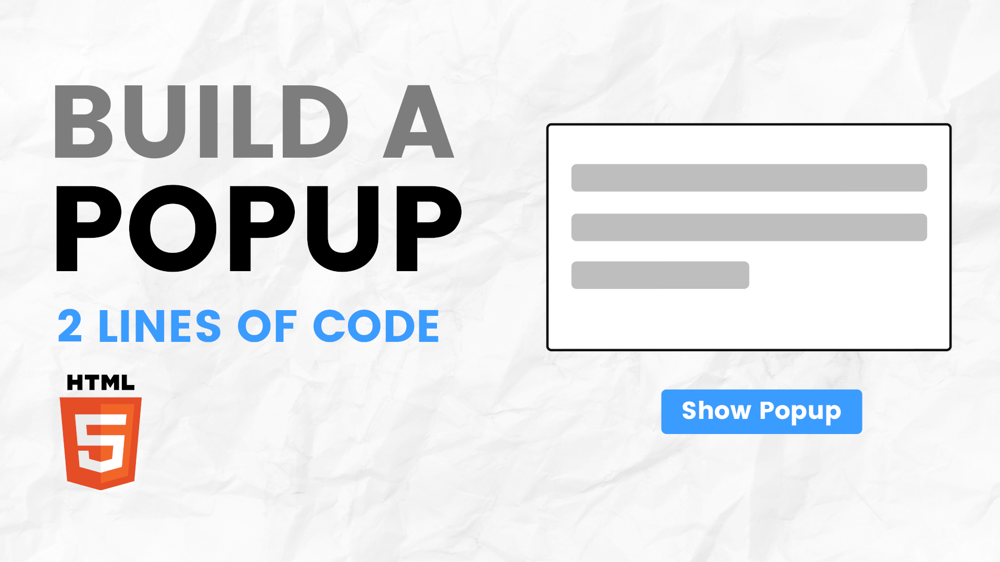

# Popup with just 2 lines of HTML | No Libraries Needed

The "Popup with Just 2 Lines of Code" tutorial leverages the new HTML popover API to create a functional popup with minimal effort and no external libraries. Using attributes like popovertarget and popover, this approach allows you to easily open and close popups directly in HTML with just a couple of lines. This method is perfect for lightweight, interactive popups without the need for complex JavaScript or external plugins.